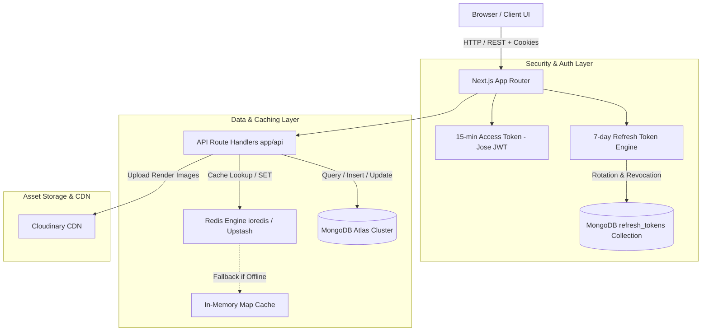

# 02. Architecture & Tech Stack

## 🏗️ Technical Architecture Overview

AI Prompt Hub is built using a modern full-stack TypeScript architecture centered around **Next.js App Router (Turbopack)**. The backend integrates **MongoDB Atlas** for persistent document storage, a hybrid **Redis Engine** (with an in-memory Map fallback) for query caching, and **Cloudinary** for image delivery.



---

## 🛠️ Technology Stack Breakdown

| Layer | Technology | Purpose & Rationale |
| :--- | :--- | :--- |
| **Framework** | Next.js 16 (App Router + Turbopack) | Fast server-side rendering, static generation, and unified API route handlers. |
| **Language** | TypeScript (Strict Mode) | End-to-end type safety across API routes, database models, and React components. |
| **Styling & UI** | Tailwind CSS v4 + Shadcn UI | Semantic CSS design tokens with support for dark and light theme switching. |
| **Authentication** | Dual-Token JWT (`jose`) + RTR | 15-minute Access Token + 7-day Refresh Token with Refresh Token Rotation in MongoDB. |
| **Database** | MongoDB Atlas | NoSQL document database for prompts, users, roles, audit logs, and refresh tokens. |
| **Cache Engine** | Redis (`ioredis` / `@upstash/redis`) | Sub-50ms query caching with automatic TTL and mutation-based cache invalidation. |
| **Cache Fallback** | In-Memory `Map` | 100% uptime fallback in `lib/redis.ts` if Redis is offline or unconfigured. |
| **Asset Storage** | Cloudinary API | Secure image uploading, CDN delivery, and automatic aspect ratio optimization. |

---

## 📊 Database Models & Schemas

### 1. Prompt Collection Schema (`prompts`)

```typescript
interface IPrompt {
  _id?: ObjectId;
  title: string;          // e.g. "Brutalist Concrete Monolith"
  prompt: string;         // Full prompt syntax with flags e.g. "--ar 16:9 --v 6.0"
  category: string;       // e.g. "Architecture", "Editorial / Portrait", "Cinematic", "Abstract"
  aiModel: string;        // e.g. "Midjourney", "DALL·E 3", "Stable Diffusion"
  aspect?: string;        // e.g. "16:9", "4:5", "3:4", "1:1"
  image?: string;         // Cloudinary URL or verified demo artwork URL
  userId?: string;        // Author user ID
  authorName?: string;    // Author display handle
  authorEmail?: string;   // Author email
  status: 'pending' | 'approved' | 'rejected'; // Moderation status
  visible: boolean;       // Public gallery visibility
  copiesCount?: number;   // Number of times copied by community
  createdAt: Date;
  updatedAt: Date;
}
```

### 2. User Collection Schema (`users`)

```typescript
interface IUser {
  _id?: ObjectId;
  name: string;
  email: string;
  password: string;       // Hashed with salt via lib/password.ts
  role: 'user' | 'creator' | 'moderator' | 'content_admin' | 'senior_admin' | 'super_admin';
  status: 'active' | 'pending' | 'approved' | 'rejected' | 'suspended';
  avatar?: string;
  createdAt: Date;
  updatedAt: Date;
  lastLogin?: Date;
}
```

### 3. Refresh Tokens Collection Schema (`refresh_tokens`)

```typescript
interface IRefreshToken {
  _id?: ObjectId;
  token: string;          // Cryptographically secure 80-char hex string (indexed unique)
  userId: ObjectId;       // References users._id (indexed)
  expiresAt: Date;        // 7-day TTL index: auto-purged by MongoDB
  createdAt: Date;
  userAgent?: string;     // Device / Browser fingerprint
  ip?: string;            // Client IP address
  isRevoked: boolean;     // Revocation flag
  replacedByToken?: string; // Pointer to newly rotated token
}
```

### 4. Role & Permissions Schema (`roles`)

```typescript
interface IRole {
  _id?: ObjectId;
  key: string;            // e.g. 'super_admin', 'senior_admin', 'content_admin', 'moderator'
  name: string;
  description: string;
  permissions: Permission[];
  isSystem?: boolean;
}
```

---

## 🔒 Role-Based Access Control (RBAC) Matrix

The system includes 24 granular permissions grouped across Dashboard, Prompt Management, User Management, Creator Moderation, Categories, Admin Management, and Activity Logs:

| Permission Group | `user` | `creator` | `moderator` | `content_admin` | `senior_admin` | `super_admin` |
| :--- | :---: | :---: | :---: | :---: | :---: | :---: |
| **Browse & Copy Prompts** | ✅ | ✅ | ✅ | ✅ | ✅ | ✅ |
| **Submit Custom Prompts** | ❌ | ✅ (Pending) | ✅ | ✅ | ✅ | ✅ |
| **Creator Studio Dashboard** | ❌ | ✅ | ✅ | ✅ | ✅ | ✅ |
| **Review & Approve Prompts** | ❌ | ❌ | ✅ | ✅ | ✅ | ✅ |
| **Publish, Hide, Edit Prompts** | ❌ | ❌ | ❌ | ✅ | ✅ | ✅ |
| **Creator Moderation** | ❌ | ❌ | ❌ | ❌ | ✅ | ✅ |
| **User Suspension / Management** | ❌ | ❌ | ❌ | ❌ | ✅ | ✅ |
| **Admin & Role Management** | ❌ | ❌ | ❌ | ❌ | ❌ | ✅ |
| **Platform Settings & Audit Logs** | ❌ | ❌ | ❌ | ❌ | ❌ | ✅ |

---

## 🎨 Design System & Theme Tokens

The application utilizes the **Light-Table Design System** with CSS semantic tokens defined in `app/globals.css`:

```css
/* Dark Mode (Signature Light-Table) */
.dark {
  --background: #14121A;  /* Deep Ink */
  --foreground: #EDE9F7;  /* High-contrast text */
  --card:       #1D1926;  /* Elevated surface */
  --secondary:  #262131;  /* Muted dark */
  --border:     #37324A;  /* Structural hairline */
  --primary:    #FF6B4A;  /* Vibrant Coral */
  --mint:       #83E6C9;  /* Mint accent */
}

/* Light Mode (Paper Table) */
:root {
  --background: #FAF8FD;  /* Crisp light canvas */
  --foreground: #14121A;  /* Deep ink text */
  --card:       #FFFFFF;  /* Pure white surface */
  --secondary:  #F3F0FA;  /* Soft lilac tint */
  --border:     #E5DFEE;  /* Light hairline */
  --primary:    #FF6B4A;  /* Vibrant Coral */
}
```
