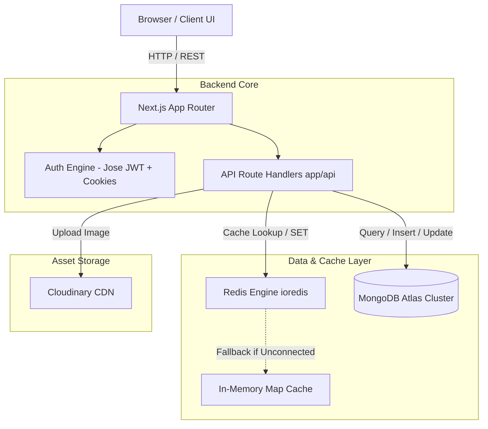

# 02. Architecture & Tech Stack

## 🏗️ Technical Architecture Overview

AI Trending Prompts is built using a modern full-stack TypeScript architecture centered around **Next.js 14 App Router**. The backend leverages **MongoDB Atlas** for persistent storage, **Redis** (with an in-memory Map fallback) for high-performance caching, and **Cloudinary** for image storage.



---

## 🛠️ Technology Stack Breakdown

| Layer | Technology | Purpose & Rationale |
| :--- | :--- | :--- |
| **Framework** | Next.js 14 (App Router) | Server-Side Rendering (SSR), Static Site Generation (SSG), and API Route Handlers in a unified codebase. |
| **Language** | TypeScript | Strong typing across API routes, UI props, database models, and cache payloads. |
| **Styling & UI** | Tailwind CSS + Shadcn UI | Utility-first CSS combined with accessible UI primitives (Radix UI) and CSS variables for dark/light themes. |
| **Database** | MongoDB Atlas | Flexible document database for storing prompt data, user profiles, and session metadata. |
| **Cache Engine** | Redis (`ioredis`) | High-speed cache for prompt query results, reducing DB load and dropping latency to sub-50ms. |
| **Cache Fallback** | In-Memory `Map` | Custom fallback cache mechanism in `lib/redis.ts` ensuring 100% uptime if Redis is unconfigured. |
| **Auth & Security** | `jose` (JWT) + HTTP-only cookies | Stateless, secure JWT authentication stored in HTTP-only cookies to prevent XSS attacks. |
| **Asset Storage** | Cloudinary API | Cloud storage and CDN optimization for prompt output images. |

---

## 📊 Database Models & Schemas

### 1. Prompt Collection Schema (`prompts`)

```typescript
interface IPrompt {
  _id?: ObjectId;
  title: string;          // Descriptive title of the prompt
  prompt: string;         // The actual prompt text
  category: string;       // e.g. Coding, Marketing, Art, Copywriting
  aiModel: string;        // e.g. ChatGPT, Midjourney, Claude, DALL-E
  image?: string;         // Cloudinary URL for preview image
  userId?: string;        // Author user ID reference
  authorName?: string;    // Author display name
  authorEmail?: string;   // Author email address
  status: 'pending' | 'approved' | 'rejected'; // Moderation status
  visible: boolean;       // Public visibility flag
  createdAt: Date;
  updatedAt: Date;
}
```

### 2. User Collection Schema (`users`)

```typescript
interface IUser {
  _id?: ObjectId;
  name: string;
  email: string;
  passwordHash: string;
  role: 'user' | 'creator' | 'admin' | 'superadmin';
  status: 'active' | 'suspended';
  permissions: string[];
  createdAt: Date;
  updatedAt: Date;
}
```

---

## 🔒 Role-Based Access Control (RBAC) Matrix

| User Role | Browse Prompts | Submit Prompts | Own Dashboard | Moderate Prompts | User Management |
| :--- | :---: | :---: | :---: | :---: | :---: |
| **User** | ✅ | ❌ | ❌ | ❌ | ❌ |
| **Creator** | ✅ | ✅ (Pending) | ✅ | ❌ | ❌ |
| **Admin** | ✅ | ✅ (Auto-Approve) | ✅ | ✅ | ❌ |
| **Super Admin** | ✅ | ✅ (Auto-Approve) | ✅ | ✅ | ✅ |
