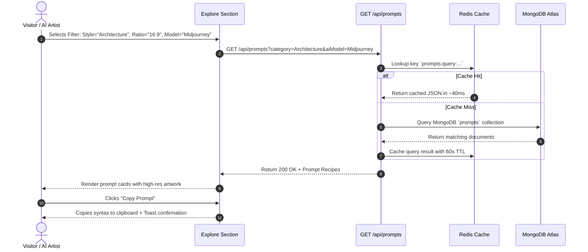
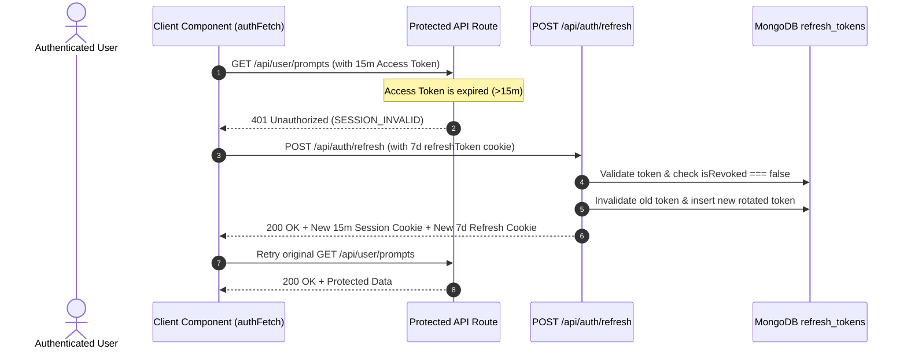

# 03. Components & Frontend Modules

## 🧩 Component Directory Structure

The frontend is modularly organized inside [`components/`](file:///c:/Users/usman/Documents/AiTrendingPrompts/AiTrendingPrompts/components), separating reusable Shadcn UI primitives from feature-specific modules and discovery engines.

```text
components/
├── ui/                     # Reusable Shadcn UI primitives (Button, Card, Dialog, Input, Sonner, etc.)
├── Navbar.tsx              # Responsive sticky navigation header with auth state & theme toggle
├── Footer.tsx              # High-contrast multi-column footer with quick links & ecosystem status
├── Hero.tsx                # Outcome-focused headline + 3D prompt-card fan container
├── FannedPromptCarousel.tsx # Zero-dependency 3D perspective-fanned carousel with gesture engine
├── TrustStrip.tsx          # Above-the-fold value pillars (Curated, Model-specific, 1-Click Copy)
├── ExploreSection.tsx      # Editor's Picks spotlight + multi-dimensional discovery filter grid
├── ComparisonSection.tsx   # Differentiator section (Why creators use AI Prompt Hub vs. random sources)
├── Features.tsx            # Visitor-focused precision engineering benefit cards
├── HowItWorks.tsx          # Active 3-step visual pipeline with render mockups
├── SocialProof.tsx         # Creator testimonials and verified capability metrics
├── CTASection.tsx          # Outcome-driven closing call to action
├── PromptDetailsModal.tsx  # Detailed prompt inspection dialog with syntax breakdown
├── PromptForm.tsx          # Prompt editor with validation & Cloudinary image upload
├── PromptsTable.tsx        # Responsive data table for managing prompt queues in dashboards
├── PortalSidebar.tsx       # Sidebar navigation for Creator Studio workspace
├── AdminSidebar.tsx        # Sidebar navigation for Admin & Super Admin control panel
└── ThemeToggle.tsx         # Accessible dark / light mode switcher using next-themes
```

---

## 🎨 Component Deep-Dives

### 1. `Hero.tsx` & `FannedPromptCarousel.tsx` (3D Perspective-Fanned Showcase)
* **Visual Aesthetic:** Editorial dark canvas (`#14121A` / `#FAF8FD`) with Coral (`#FF6B4A`) and Mint (`#83E6C9`) radiance.
* **Outcome-Focused Headline:** `Find image prompts that actually work.` with subtext explaining exact parameter support for Midjourney, DALL·E 3, and Stable Diffusion.
* **Spatial 3D Geometry (`perspective: 1200px`):** 5 visible prompt cards configured with dynamic translations (`translateX`, `translateY`, `rotateZ`, `rotateY`, `scale`) calculated using cyclic offset from the active card.
* **1500ms Kinetic Physics:** Governed by `cubic-bezier(0.16, 1, 0.3, 1)` for ultra-smooth easing.
* **Pointer Capture & Gesture Drag:** Full pointer drag support (`setPointerCapture`) for desktop mice and mobile touch swipes with gesture lock.
* **Instant Clipboard Copy:** Integrated with global `sonner` toast notifications and tactile state changes.

---

### 2. `TrustStrip.tsx` (Above-the-Fold Value Strip)
Positioned directly beneath the Hero to provide immediate visitor credibility:
* **100% Curated Prompts:** Tested for high output fidelity.
* **Model-Specific Syntax:** Midjourney v6, DALL·E 3, and SDXL flags attached.
* **One-Click Copy:** Complete parameters, weights, and aspect ratios.
* **Visual Previews Included:** See the exact render before spending generation credits.

---

### 3. `ExploreSection.tsx` (Discovery Engine & Editor's Picks)
* **Editor's Picks Spotlight:** Top 3 standout prompts showcased with gold/coral illuminated borders and hand-tested badges.
* **Discovery View Mode Tabs:** `[🔥 Trending]` `[⭐ Popular]` `[✨ Newest]`
* **Multi-Dimensional Filter Matrix:**
  * **Style / Category:** *All, Architecture, Editorial / Portrait, Cinematic, Abstract*
  * **Model:** *All Models, Midjourney, DALL·E 3, Stable Diffusion*
  * **Aspect Ratio:** *All Ratios, 16:9, 4:5, 3:4, 1:1*
  * **Sort:** *Most Popular, Most Copied, Newest*
* **Inspect Recipe Modal:** Quick preview button triggering `<PromptDetailsModal />` for deep parameter inspection.

---

### 4. `ComparisonSection.tsx` (Why Creators Choose AI Prompt Hub)
A high-impact side-by-side comparison table contrasting random sources (*Pinterest, Reddit, random prompt lists*) with AI Prompt Hub across 5 key dimensions:
1. Model Compatibility
2. Visual Proof
3. Copy Readiness
4. Quality Control
5. Organization & Workspace

---

### 5. `Features.tsx` & `HowItWorks.tsx`
* **Features:** Refocused on creator benefits:
  1. *See before you generate*
  2. *Copy exactly what you need*
  3. *Know which model it targets*
  4. *Prompts that actually work*
  5. *Save your favorites*
  6. *Create & publish*
* **How It Works:** Visual 3-step pipeline with embedded UI mockups:
  * `01 / DISCOVER`: Browse visual prompts & real renders.
  * `02 / COPY`: Copy exact formatted syntax & aspect ratio flags.
  * `03 / CREATE`: Paste into AI generation tool to produce final artwork.

---

### 6. `SocialProof.tsx` & `CTASection.tsx`
* **Social Proof:** Capability highlights (*100% Parameter-Accurate, 3+ Major Engines, 1-Click Instant Copy*) + verified creator testimonials from Concept Artists, Creative Directors, and AI Product Designers.
* **CTA Section:** Clean conversion conclusion: `Stop searching. Start creating.` with *Explore Prompts* and *Join Free* triggers.

---

### 7. `lib/api-client.ts` (Universal Silent Refresh Interceptor)
Exports `authFetch(url, options)` which intercepts `401 Unauthorized` responses from any client component, calls `POST /api/auth/refresh` silently, updates the `session` cookie, and seamlessly retries the original request without user interruption.

---

## 🔄 User Journeys & Sequence Diagrams

### Flow 1: Public Prompt Exploration & Copy Workflow


### Flow 2: Dual-Token Silent Refresh Flow

