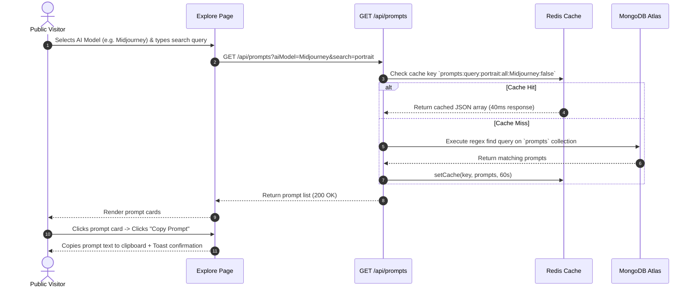
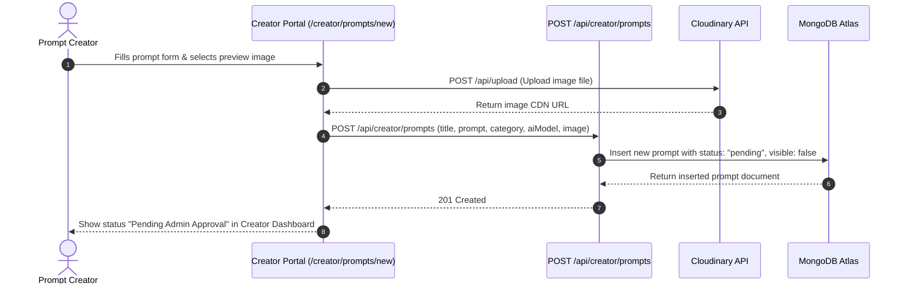

# 03. Components & Frontend Modules

## 🧩 Component Directory Structure

The frontend is built modularly inside the [`components/`](file:///c:/Users/usman/Documents/AiTrendingPrompts/AiTrendingPrompts/components) directory, separating reusable UI primitives from domain-specific feature components.

```text
components/
├── ui/                   # Reusable Shadcn UI primitives (Button, Card, Dialog, Input, Select, Table, Badge, etc.)
├── Navbar.tsx            # Responsive main navigation header with auth state & theme toggle
├── Footer.tsx            # Global film-strip mark footer with navigation links & branding
├── Hero.tsx              # 3D fanned editorial card carousel hero with cursor drag/swipe & 1-sec entrance animations
├── ExploreSection.tsx    # Interactive prompt catalogue with AI Model & Category filter pills
├── Features.tsx          # 6 contact sheet feature cards (01/PREVIEW, 02/COPY, 03/TAXONOMY, etc.)
├── HowItWorks.tsx        # 3 film-frame step counters (01/DISCOVER, 02/COPY, 03/GENERATE)
├── CTASection.tsx        # High-contrast paper band CTA section (#F3F0FA)
├── PromptDetailsModal.tsx # Detailed prompt inspection modal with one-click copy & parameters
├── AddPromptModal.tsx    # Modal wrapper for submitting new prompts
├── PromptForm.tsx        # Form with validation & Cloudinary image upload for prompt creation
├── PromptsTable.tsx      # Data table for managing prompts in admin/creator dashboards
├── PortalSidebar.tsx     # Navigation sidebar for Creator portal dashboard
└── AdminSidebar.tsx      # Navigation sidebar for Admin & Super Admin dashboard
```

---

## 🎨 UI & Component Highlights

### 1. `Hero.tsx` (3D Fanned Editorial Card Carousel)
* **Visual Direction:** Photographer's light table & high-end editorial digital design portfolios.
* **Centered UI Top Section:** Staggered 1-second fade up entrance animations (`anim-fade-up-1` through `anim-fade-up-4`) for Eyebrow badge, single-color `Space Grotesk` headline (`Discover & copy battle-tested AI image prompts.`), subtitle copy, and CTAs.
* **3D Fanned Arch Stack (`perspective: 1200px`):** 5 visible cards arranged in a fanned arc (`rotateZ(-15deg)` to `rotateZ(15deg)`) with dark cinematic visual swatches and centered lowercase italic titles (`spatial`, `identity`, `editorial`, `digital`, `motion`).
* **1000ms Smooth Transition & Gesture Support:**
  * **Duration:** Exact 1-second (`1000ms`) cubic-bezier spring easing curve (`cubic-bezier(0.34, 1.25, 0.64, 1)`).
  * **Cursor Drag & Swipe:** Full pointer drag support (`cursor-grab` / `cursor-grabbing`) for desktop mouse and mobile touch.
  * **Direct Selection:** Clicking any background card directly shifts focus to that frame.
* **One-Click Copy Trigger:** Active card features a prompt syntax box, parameter tags (`CS·002`, `--ar 4:5`, `MJ v6.0`), and a working Copy button with toast confirmation.

### 2. `ExploreSection.tsx` (Interactive Catalogue)
* **Function:** Embedded prompt search & discovery engine directly on the landing page (`#explore`).
* **Key Capabilities:**
  * Real-time search filter matching prompt syntax & keywords.
  * AI Model filter pills (`ChatGPT`, `Midjourney`, `Claude`, `DALL-E 3`, `SDXL`).
  * Domain category filter pills (`Couple Portraits`, `Editorial`, `Fantasy`, `Architecture`, `Abstract`).
  * 6-card skeleton loading state & interactive prompt detail modal.

### 3. `Navbar.tsx` & `Footer.tsx`
* **Function:** Top and bottom application layout shells.
* **Key Capabilities:**
  * Dynamically renders nav links and action buttons based on user authentication role (`user`, `creator`, `admin`).
  * Sticky blur backdrop (`#14121A`/95) and clean film-strip brand mark.

### 4. `PromptForm.tsx` & `AddPromptModal.tsx`
* **Function:** Handles prompt creation for both Creators (submitting pending prompts) and Admins (creating pre-approved prompts).
* **Key Capabilities:**
  * Validates prompt title, body, category, and AI model choices.
  * Integrates direct Cloudinary image upload via `/api/upload` endpoint.
  * Automatically invalidates Redis cache upon submission to keep UI instantly updated.

---

## 🔄 User Journeys & System Flows

### Flow 1: Public Prompt Discovery & Copying


### Flow 2: Creator Registration & Prompt Submission

