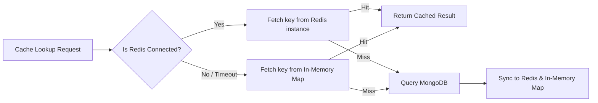

# 04. API & Redis Caching System

## 🌐 API Route Directory

All API handlers are defined under `app/api/` and return standardized JSON responses.

```text
app/api/
├── auth/
│   ├── login/route.ts      # POST /api/auth/login — Authenticates users & sets HTTP-only JWT cookie
│   ├── logout/route.ts     # POST /api/auth/logout — Clears session cookie
│   ├── check/route.ts      # GET /api/auth/check — Validates session token
│   └── me/route.ts         # GET /api/auth/me — Returns current authenticated user profile & permissions
├── prompts/
│   ├── route.ts            # GET /api/prompts (cached list) & POST /api/prompts (create prompt)
│   └── [id]/route.ts       # PUT /api/prompts/:id & DELETE /api/prompts/:id (update/delete prompt)
├── creator/
│   └── prompts/route.ts    # GET /api/creator/prompts — Fetch prompts owned by logged-in creator
├── admin/
│   ├── prompts/
│   │   └── [id]/route.ts   # PATCH /api/admin/prompts/:id — Moderate prompt status (approve/reject/visibility)
│   └── users/
│       └── [id]/route.ts   # PATCH /api/admin/users/:id — Manage user roles & account status
├── upload/route.ts         # POST /api/upload — Upload preview images to Cloudinary
└── demo/route.ts           # GET/POST /api/demo — Test endpoint for Redis connection verification
```

---

## ⚡ API Reference

### 1. `GET /api/prompts`
Fetch public visible prompts with optional search, category, and AI model filtering. Uses Redis caching.

* **Query Parameters:**
  * `search` *(optional)*: Case-insensitive search string matching title or prompt text.
  * `category` *(optional)*: Filter by domain category (e.g. `Coding`, `Marketing`, `General`).
  * `aiModel` *(optional)*: Filter by target AI model (e.g. `ChatGPT`, `Midjourney`, `Claude`).
  * `all` *(optional)*: If `true` and user is Admin, returns all prompts including pending/hidden.

* **Response (`200 OK`):**
  ```json
  [
    {
      "_id": "64f1a2b3c4d5e6f7a8b9c0d1",
      "title": "Master Full-Stack Architect Prompt",
      "prompt": "Act as a Senior Principal Architect...",
      "category": "Coding",
      "aiModel": "ChatGPT",
      "image": "https://res.cloudinary.com/dpw0crp1o/image/upload/v12345/prompt1.png",
      "authorName": "Alex Creator",
      "status": "approved",
      "visible": true,
      "createdAt": "2026-08-22T10:00:00.000Z"
    }
  ]
  ```

### 2. `POST /api/prompts`
Submit a new prompt. Requires authentication.

* **Request Body:**
  ```json
  {
    "title": "SEO Blog Post Writer",
    "prompt": "Write a 1500-word article on...",
    "category": "Copywriting",
    "aiModel": "Claude",
    "image": "https://res.cloudinary.com/..."
  }
  ```
* **Behavior:**
  * If created by a **User** or **Creator**: saved as `status: "pending"`, `visible: false`.
  * If created by an **Admin**: saved as `status: "approved"`, `visible: true`.
  * Automatically invalidates Redis cache keys starting with `prompts:`.

---

## 🚀 Redis Caching System Architecture

The caching layer in [`lib/redis.ts`](file:///c:/Users/usman/Documents/AiTrendingPrompts/AiTrendingPrompts/lib/redis.ts) is engineered for zero-downtime high throughput.

### 1. Hybrid Cache Strategy



### 2. Cache Key Conventions & TTL

| Cache Key Pattern | TTL (Seconds) | Description | Invalidation Event |
| :--- | :---: | :--- | :--- |
| `prompts:query:{search}:{category}:{aiModel}:{all}` | `60s` | Cached response for public prompt listings | New prompt created, prompt updated, deleted, or status moderated |
| `demo:cache:sample_post` | `600s` | Demo test endpoint cache | Manual POST request to `/api/demo` |

### 3. Invalidation Implementation

When any mutation occurs (e.g. creating, updating, or deleting a prompt), the API calls:

```typescript
import { clearCachePattern } from '@/lib/redis';

// Invalidate all prompt listing query caches instantly
await clearCachePattern('prompts:');
```

This guarantees that visitors always receive fresh data after a modification while benefiting from sub-50ms responses for repeated queries.
