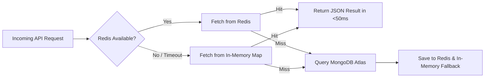

# 04. API & Redis Caching System

## 🌐 API Route Directory

All backend route handlers reside inside `app/api/` and return standardized, error-sanitized JSON responses.

```text
app/api/
├── auth/
│   ├── login/route.ts          # POST /api/auth/login — Authenticates & sets Access (15m) + Refresh (7d) cookies
│   ├── register/route.ts       # POST /api/auth/register — Registers user/creator & issues dual tokens
│   ├── refresh/route.ts        # POST /api/auth/refresh — Rotates Refresh Token & issues new 15m Access Token
│   ├── logout/route.ts         # POST /api/auth/logout — Revokes Refresh Token in DB & clears cookies
│   ├── check/route.ts          # GET /api/auth/check — Checks session status with silent refresh recovery
│   └── me/route.ts             # GET /api/auth/me — Returns active user profile, role, and permissions
├── prompts/
│   ├── route.ts                # GET /api/prompts (cached list) & POST /api/prompts (create prompt)
│   └── [id]/route.ts           # GET, PUT, DELETE /api/prompts/:id (fetch/update/delete individual prompt)
├── creator/
│   └── prompts/
│       ├── route.ts            # GET & POST /api/creator/prompts — Manage creator-owned recipes
│       └── [id]/route.ts       # GET, PUT, DELETE /api/creator/prompts/:id — Creator edit/delete
├── admin/
│   ├── prompts/
│   │   ├── route.ts            # GET /api/admin/prompts — Fetch all prompts (including pending)
│   │   └── [id]/review/route.ts # PATCH /api/admin/prompts/:id/review — Approve/reject moderation
│   ├── users/
│   │   └── route.ts            # GET & PATCH /api/admin/users — User account management & suspension
│   ├── roles/
│   │   └── route.ts            # GET & PUT /api/admin/roles — Dynamic RBAC permission updates
│   ├── categories/
│   │   └── route.ts            # GET, POST, DELETE /api/admin/categories — Taxonomy management
│   ├── logs/
│   │   └── route.ts            # GET /api/admin/logs — Platform security audit logs
│   └── settings/
│       └── route.ts            # GET & PUT /api/admin/settings — Global platform configurations
├── user/
│   ├── profile/route.ts        # GET & PUT /api/user/profile — Manage user display profile
│   └── prompts/route.ts        # GET & POST /api/user/prompts — Manage saved personal prompt collections
├── upload/route.ts             # POST /api/upload — Secure image upload to Cloudinary CDN
├── health/route.ts             # GET /api/health — Health check & DB connection diagnostics
└── demo/route.ts               # GET/POST /api/demo — Cache benchmark & verification endpoint
```

---

## ⚡ Core API Endpoint Reference

### 1. `POST /api/auth/refresh`
Silently exchanges an existing valid `refreshToken` cookie for a new 15-minute `session` JWT and rotates the refresh token in the database.

* **Request Headers / Cookies:**
  * Cookie: `refreshToken=<7-day-hex-token>`
* **Response (`200 OK`):**
  ```json
  {
    "message": "Session refreshed successfully",
    "user": {
      "id": "64f1a2b3c4d5e6f7a8b9c0d1",
      "name": "Alex Creator",
      "email": "alex@example.com",
      "role": "creator",
      "status": "active",
      "permissions": ["prompts:view", "prompts:publish"]
    }
  }
  ```
* **Set-Cookie Headers:**
  * `session=<new-15m-jwt>; HttpOnly; Secure; SameSite=Lax; Max-Age=900; Path=/`
  * `refreshToken=<new-7d-hex>; HttpOnly; Secure; SameSite=Lax; Max-Age=604800; Path=/`

---

### 2. `POST /api/auth/login`
Authenticates credentials, updates user `lastLogin` timestamp, and sets dual auth cookies.

* **Request Body:**
  ```json
  {
    "email": "user@example.com",
    "password": "SecurePassword123!"
  }
  ```
* **Security & Rate Limiting:** Enforces `checkRateLimit('login:<ip>', 5, 60000)` (max 5 attempts per minute per IP).

---

### 3. `GET /api/prompts`
Fetch public visible prompt recipes with multi-dimensional filtering. Powered by Redis cache.

* **Query Parameters:**
  * `search` *(optional)*: Matches prompt title or recipe syntax.
  * `category` *(optional)*: e.g. `Architecture`, `Cinematic`, `Abstract`, `Editorial / Portrait`.
  * `aiModel` *(optional)*: e.g. `Midjourney`, `DALL·E 3`, `Stable Diffusion`.
  * `aspect` *(optional)*: e.g. `16:9`, `4:5`, `3:4`, `1:1`.
* **Cache Header / Latency:**
  * **Cache Hit:** ~35ms – 50ms response time.
  * **Cache Miss:** Queries MongoDB Atlas, stores in Redis with a 60-second TTL.

---

## 🚀 Redis Caching System Architecture

The caching layer in [`lib/redis.ts`](file:///c:/Users/usman/Documents/AiTrendingPrompts/AiTrendingPrompts/lib/redis.ts) supports both local Docker Redis and serverless **Upstash Redis** on Vercel.

### 1. Cache Hierarchy & Resilience



### 2. Cache Key Conventions & Invalidation Rules

| Cache Key Pattern | TTL | Invalidation Triggers |
| :--- | :---: | :--- |
| `prompts:query:{search}:{category}:{aiModel}:{aspect}` | `60s` | Creating, editing, moderating, or deleting a prompt (`clearCachePattern('prompts:')`) |
| `categories:list` | `300s` | Adding or deleting a category in Admin panel |
| `demo:cache:sample_post` | `600s` | Manual test invocation on `/api/demo` |

---

## 🛡️ Error Sanitization & Diagnostics (`lib/errors.ts`)

To prevent sensitive database details from leaking to clients, all API errors are processed through `getFriendlyErrorMessage(error)`:
* **MongoDB TLS Alert 80 / SSL Connection Drops:** Maps to clear instructions regarding MongoDB Atlas IP Whitelisting (`0.0.0.0/0`).
* **Duplicate Key (E11000):** Maps to clean user-friendly notification (e.g. *“An account with this email already exists.”*).
* **Rate Limits (429):** Returns *“Too many requests. Please wait a moment before trying again.”*
